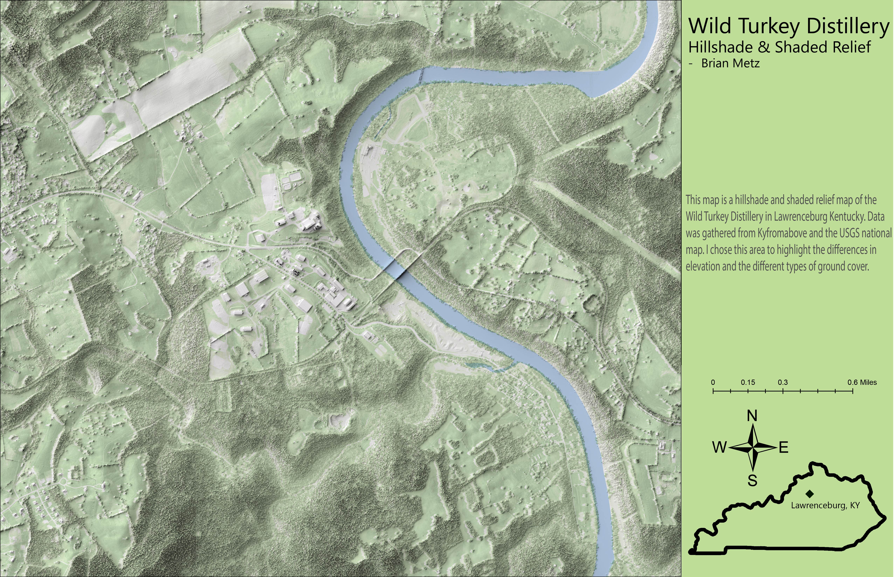

# Wild Turkey Distillery
## Lawrenceburg, Kentucky

This map looks at the Wild Turkey bourbon distillery in Lawrenceburg, Kentucky. I chose that area because of the massive terrain differences at the Kentucky River and the differences in ground cover. The map shows different colors for the different ground covers, such as fields, grass, and forests. 

     
*This is the map looking at Tyrone Rd along with the River and the Distillery*

     

The Data for the map was gathered from KyFromAbove database, using the NAIP, DSM, and DEM. Water features and forest data was gathered from the USGS National Map. 

Map was made in ArcGIS Pro.
Layout was created in ArcGIS Pro and finished in Adobe Illustrator.
Repository was created on GIThub and tweaked with Visual Code Studio.